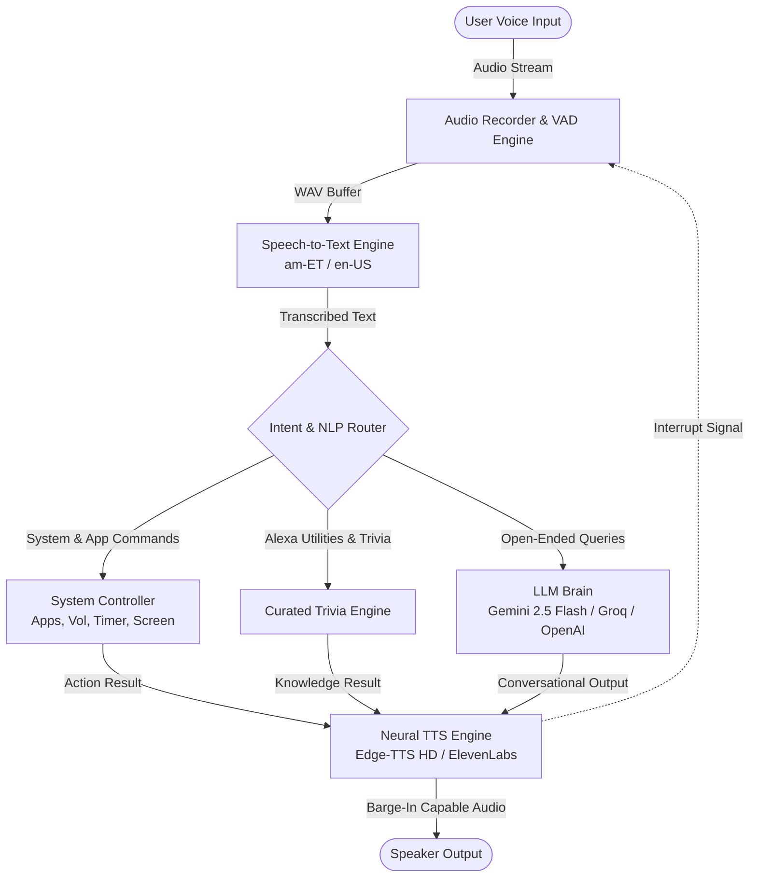

<div align="center">

# ✦ Yakob (ያዕቆብ)
### Intelligent Multilingual Desktop Voice Assistant
*Native Amharic (አማርኛ) & English Natural Language Processing, Neural Speech Synthesis, and Windows System Automation.*

[](https://python.org)
[](https://microsoft.com/windows)
[](https://ai.google.dev)
[](LICENSE)

[**Features**](#-features) • [**Architecture**](#-architecture) • [**Quick Start**](#-quick-start) • [**Voice Commands**](#-command-reference) • [**Voice Training**](#-voice-training)

</div>

---

## 📖 Overview

**Yakob (ያዕቆብ)** is an enterprise-grade, privacy-conscious desktop voice assistant engineered specifically for bidirectional **Amharic (አማርኛ)** and **English** voice interactions. 

Combining **real-time Voice Activity Detection (VAD)**, **high-definition neural speech synthesis**, **multi-provider LLM intelligence (Google Gemini 2.5 Flash / Groq Llama 3.3)**, and **direct Windows API automation**, Yakob provides an intuitive, hands-free computing experience packaged inside a modern minimalist dark-themed interface and a sleek floating desktop widget.

---

## 🏛️ System Architecture



---

## ✨ Key Capabilities

- **🌐 Bidirectional Bilingual NLU**:
  - Full native recognition of Ge'ez script and Amharic phonology (`am-ET`) alongside American English (`en-US`).
  - Automatic language identification with hybrid fallback resolution.

- **⚡ Voice Barge-In / Instant Interruption**:
  - Full-duplex audio pipeline allows users to interrupt ongoing voice responses at any instant simply by speaking into the microphone.

- **🔊 High-Definition Neural TTS & Natural Prosody**:
  - Male and female neural voices (`am-ET-AmehaNeural`, `en-US-AndrewMultilingualNeural`, `en-US-GuyNeural`, `am-ET-MekdesNeural`).
  - Tuned with natural sentence cadence, conversational breath pauses, and a lively `+15%` speech pace.
  - Built-in adapter for **ElevenLabs Multilingual v2** voice models.

- **🧠 Multi-Model Conversational Intelligence**:
  - Powered by **Google Gemini 2.5 Flash** for rapid general knowledge, trivia recall, and complex reasoning.
  - Compatible with **Groq (Llama 3.3 70B)**, **OpenAI (GPT-4o-mini)**, and a **Built-in Offline Knowledge Engine** requiring zero API keys.

- **🖥️ Minimalist UI & Floating Desktop Widget**:
  - **Main Console**: Grounded obsidian dark palette (`#0d0f14`), chat cards, audio energy meters, and responsive action chips.
  - **Floating Pill Widget**: Draggable, frameless, always-on-top pill widget (styled like Apple Dynamic Island / Siri) for unobtrusive multitasking.

- **🔇 Zero-Console Silent Windows Integration**:
  - Standalone `.vbs` and `.lnk` launchers executing via `pythonw.exe` without popping up command prompt windows.

---

## 🚀 Quick Start

### Prerequisites
- **Operating System**: Windows 10 / 11 (64-bit)
- **Python**: Version 3.10 or newer
- **Microphone & Speakers**

### Installation

1. **Clone the repository**:
   ```bash
   git clone https://github.com/TheDevCharlie/yakob-desktop-assistant.git
   cd yakob-desktop-assistant
   ```

2. **Install dependencies**:
   ```bash
   pip install -r requirements.txt
   ```

3. **Generate Windows Desktop Shortcuts (Optional)**:
   ```bash
   python create_desktop_shortcut.py
   ```
   *This places `Yakob Assistant.lnk` and `Yakob Widget.lnk` directly on your Windows Desktop.*

---

## 🎮 Launch Options

| Mode | Execution Command | Description |
|---|---|---|
| **Desktop Shortcuts** | Double-click Desktop Icon | Launches silently with zero terminal popups |
| **Main Application** | `python main.py` | Full chat interface with settings and visualizer |
| **Floating Widget** | `python main.py --widget` | Compact, draggable always-on-top pill widget |
| **CLI / Terminal** | `python main.py --cli --lang am` | Lightweight terminal-only conversational mode |

---

## 📋 Command Reference

### 🇪🇹 የአማርኛ ድምፅ ትእዛዛት (Amharic)

| ምድብ | የትእዛዝ ምሳሌ | የተግባር ዝርዝር |
|---|---|---|
| **⏱️ ታይመርና አላርም** | `"የ 5 ደቂቃ ታይመር ሙላ"`, `"የ 30 ሰከንድ ታይመር"` | የጊዜ ቆጣሪ ማስጀመርና ድምፅ ማሰማት |
| **☀️ የአየር ሁኔታ** | `"የአየር ሁኔታ ምን ይመስላል?"`, `"አዲስ አበባ የአየር ሁኔታ"` | ወቅታዊ የሙቀት መጠንና የአየር ሁኔታ መረጃ |
| **📰 ዜናና መረጃ** | `"የዛሬ ዜና ንገረኝ"`, `"አዳዲስ ዜናዎች"` | የወቅቱ ዋና ዋና ዜናዎች ማጠቃለያ |
| **🪙 ሳንቲም & ዳይስ** | `"ሳንቲም ጣል"`, `"ዳይስ ጣል"` | የሳንቲም (ሰው/ቁጥር) እና የዳይስ (1-6) ዕጣ ማውጣት |
| **🧩 እንቆቅልሽ & እውነታ** | `"እንቆቅልሽ ንገረኝ"`, `"አስገራሚ እውነታ ንገረኝ"` | ባህላዊ እንቆቅልሾች እና የሳይንስ እውነታዎች |
| **🎵 ሙዚቃ ማጫወት** | `"ሙዚቃ አጫውት"`, `"ዩቲዩብ ላይ የኢትዮጵያ ሙዚቃ ፈልግ"` | ዩቲዩብ ወይም ስፖቲፋይ ላይ ሙዚቃ መክፈት |
| **🚀 መተግበሪያዎች** | `"ክሮምን ክፈት"`, `"ካልኩሌተር ክፈት"`, `"ኖትፓድ ክፈት"`, `"ፋይል ክፈት"` | የዊንዶውስ መተግበሪያዎችን ማስነሳት |
| **🔍 ኢንተርኔት ፍለጋ** | `"ስለ ኢትዮጵያ በጎግል ፈልግ"`, `"ስለ አርቴፊሻል ኢንተለጀንስ ፈልግ"` | ቀጥታ የጎግል ድረ-ገጽ ፍለጋ |
| **🕒 ሰዓትና ቀን** | `"ስንት ሰዓት ነው?"`, `"ዛሬ ምን ቀን ነው?"` | የሰዓትና የቀን መረጃ በአማርኛ አቆጣጠር |
| **🔊 የድምፅ ቁጥጥር** | `"ድምፅ ጨምር"`, `"ድምፅ ቀንስ"`, `"ድምፅ አጥፋ"` | የኮምፒውተር ዋና ድምፅ መጠን መቆጣጠር |
| **📸 ስክሪንሾት** | `"ስክሪንሾት አንሳ"`, `"ስክሪኑን ፎቶ አንሳ"` | ስክሪን ፎቶ አንስቶ በPictures ማህደር ማስቀመጥ |
| **🔋 ባትሪና ሃይል** | `"የባትሪ መጠን ስንት ነው?"`, `"ኮምፒውተሩን ቆልፍ"` | የባትሪ መረጃ እና ስክሪን መቆለፍ |
| **🧮 ሒሳብ ስሌት** | `"ስንት ነው 45 ሲደመር 35"`, `"50 ሲባዛ በ 4"` | ፈጣን የድምፅ ሒሳብ ስሌቶች |

---

### 🇬🇧 English Voice Commands

| Category | Spoken Command Example | Action Description |
|---|---|---|
| **⏱️ Timers & Alarms** | `"Set a timer for 5 minutes"`, `"Timer for 30 seconds"` | Launches background timer with audio alert |
| **☀️ Weather** | `"What's the weather like?"`, `"Weather in London"` | Fetches live temperature and conditions |
| **📰 News** | `"What's the latest news?"`, `"Today's headlines"` | Opens Google News headlines |
| **🪙 Utilities** | `"Flip a coin"`, `"Roll a die"` | Random coin toss & 6-sided die generator |
| **🧩 Trivia & Facts** | `"Tell me a riddle"`, `"Tell me a fact"`, `"Give me a quote"` | General trivia, riddles, and daily motivation |
| **🎵 Media Playback** | `"Play music"`, `"Play The Weeknd on YouTube"` | Direct media lookup and playback |
| **🚀 App Launcher** | `"Open Chrome"`, `"Open Calculator"`, `"Launch VS Code"` | Launches registered Windows executables |
| **🔍 Web Search** | `"Search for Python tutorials"`, `"Look up machine learning"` | Executes Google search queries |
| **🕒 Time & Date** | `"What time is it?"`, `"What is today's date?"` | Reports formatted system time and date |
| **🔊 System Audio** | `"Volume up"`, `"Volume down"`, `"Mute volume"` | Adjusts master system volume levels |
| **📸 Screenshot** | `"Take screenshot"`, `"Capture screen"` | Saves PNG screenshot to Pictures folder |
| **🔋 Power & Security**| `"Battery status"`, `"Lock PC"` | Checks battery percentage / locks workstation |
| **🧮 Spoken Math** | `"What is 45 plus 55"`, `"Calculate 150 divided by 3"` | Real-time arithmetic evaluation |

---

## 🎙️ Voice Training

Yakob includes an automated open-source pipeline to record and train custom Amharic voice models for free using **Google Colab GPUs** and **Coqui XTTS-v2**:

1. **Record Training Samples**:
   ```bash
   cd train_voice
   python prepare_amharic_dataset.py
   ```
2. **Follow the Colab GPU Guide**:
   Refer to [`train_voice/COLAB_TRAINING_GUIDE.md`](train_voice/COLAB_TRAINING_GUIDE.md) to generate custom speaker embeddings with zero hardware costs.

---

## 📂 Repository Structure

```
yakob-desktop-assistant/
├── main.py                     # Entry point (GUI, Widget, and CLI modes)
├── config.py                   # Aliases, voice models, website shortcuts, constants
├── requirements.txt            # Project dependency specifications
├── run_assistant.bat           # 1-Click batch launcher
├── Yakob_Silent.vbs            # Silent VBS background launcher
├── Yakob_Widget.vbs            # Silent Widget background launcher
├── create_desktop_shortcut.py  # Automated Windows desktop shortcut generator
├── core/
│   ├── audio_recorder.py       # VAD audio stream capture via sounddevice
│   ├── speech_recognizer.py    # Google Speech-to-Text (am-ET & en-US)
│   ├── tts_engine.py           # Neural TTS engine with barge-in support
│   ├── system_controller.py    # Direct Windows OS automation & utilities
│   ├── command_processor.py    # Multilingual intent parser & dispatcher
│   └── llm_brain.py            # Gemini 2.5 Flash / Groq / OpenAI / Offline Trivia
├── gui/
│   ├── app_window.py           # Minimalist dark glassmorphism desktop app
│   └── widget_window.py        # Frameless floating desktop pill widget
├── train_voice/
│   ├── prepare_amharic_dataset.py  # Interactive Amharic dataset recorder
│   └── COLAB_TRAINING_GUIDE.md     # Step-by-step free Colab GPU training guide
└── tests/
    └── test_assistant.py       # Automated unit test suite (15/15 passing)
```

---

## 📄 License

This project is licensed under the **MIT License** — see the [LICENSE](LICENSE) file for details.
